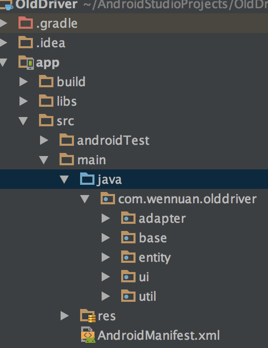

# OldDriver
##整体结构
项目为总体结构为MVC模式,其主体结构为一下几个包:

* adapter:主要是列表的适配器存放位置
* base:主要是基类的包,包括项目的BaseActivity、BaseApplication等
* entity:POJO类,对应项目的实体
* ui:项目的主要ui界面、存放activity和fragment,根据模块可分为login、main、map、widget四个模块,各自对应
  显示的activity
* util:工具库,包括一些常用的工具类

